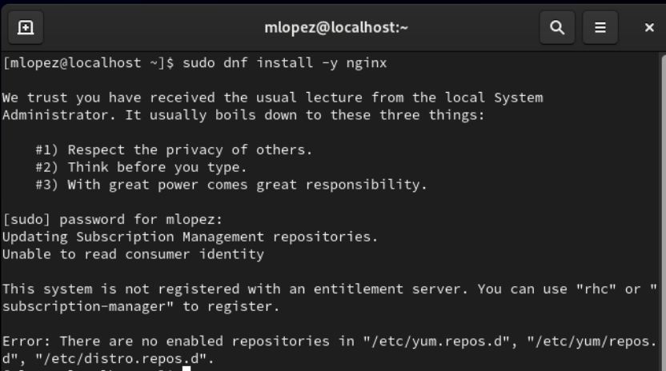
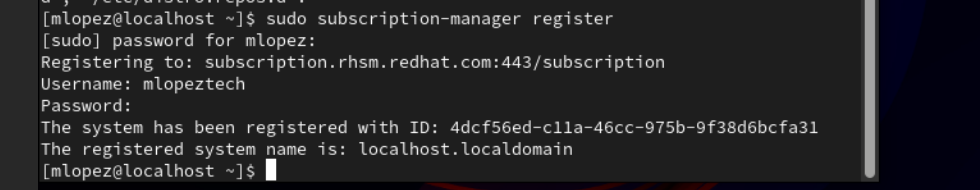
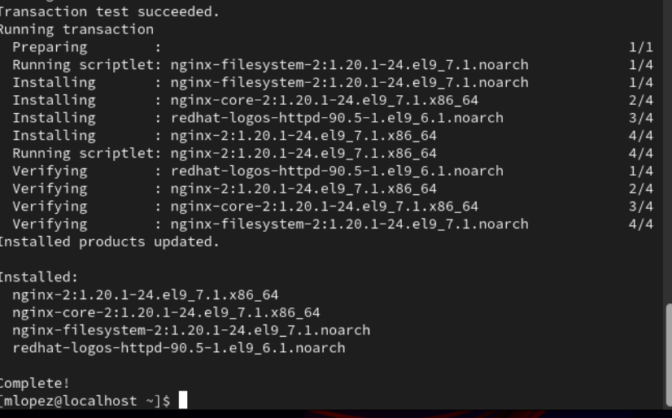
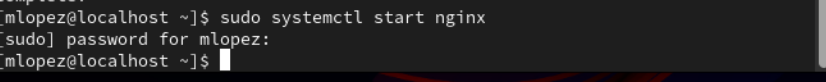
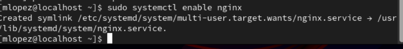
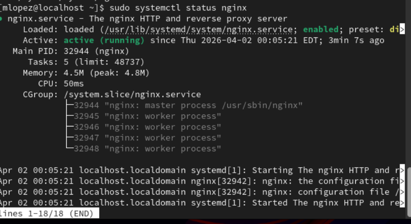

# SEV-1 Web Application Outage (Nginx Service Failure on RHEL 9 Host)

---

## Scenario

During an active shift, I was monitoring alerts for Linux-based application servers supporting an internal web application used by multiple departments.

A critical alert was triggered indicating that HTTP health checks to a Red Hat Enterprise Linux 9 host were failing. The alert showed that the application was no longer responding on port 80.

Shortly after the alert, users reported that the application was inaccessible and requests were timing out.

Due to the impact on business operations and complete loss of application availability, the issue was classified as a SEV-1 incident.

As the responding engineer, my responsibility was to validate the outage, isolate whether the issue was related to the application service, port availability, or host-level conditions, restore service functionality, and confirm full recovery.

---

## Environment

- Operating System: Red Hat Enterprise Linux 9
- Platform: VirtualBox (simulating production host)
- Application: Nginx Web Server
- Monitoring: Simulated alert (Splunk-style)
- Incident Type: Application Outage
- Severity: SEV-1

---

## Incident Trigger

Monitoring indicated failed HTTP checks on port 80, signaling that the application was no longer responding.

---

## Initial Symptoms

- application inaccessible
- failed HTTP requests
- connection timeouts
- user-reported outage

---

## Impact Assessment

The application was completely unavailable to users, impacting multiple departments relying on the service.

Due to full service disruption, this incident was treated as SEV-1 requiring immediate response.

---

## 🚨 Pre-Incident Setup Issue (Repository Access Failure)

During initial setup, package installation failed due to the system not being registered with Red Hat Subscription Management.

### Error Observed

sudo dnf install -y nginx

Resulted in:

system not registered

no enabled repositories

package installation failure

### 📸 Screenshot:

### Resolution

The system was registered and repositories were enabled:

sudo subscription-manager register

sudo subscription-manager attach --auto

sudo subscription-manager repos --enable=rhel-9-for-x86_64-baseos-rpms

sudo subscription-manager repos --enable=rhel-9-for-x86_64-appstream-rpms

### Confirmation 

After enabling repositories, package installation succeeded.

___
# PHASE 1 — SERVICE SETUP (BASELINE)

## Objective

Deploy a working web service to simulate a production application before failure.

---

### Step 1 — Install Nginx

sudo dnf install -y nginx

### STEP 2 — START NGINX

sudo systemctl start nginx

🧠 What this does

Starts the web service so it begins accepting requests

### STEP 3 — ENABLE NGINX (IMPORTANT FOR REALISM)

sudo systemctl enable nginx

### STEP 4 — VERIFY SERVICE IS RUNNING

sudo systemctl status nginx

🧠 What you are LOOKING FOR

You MUST see: active (running)

