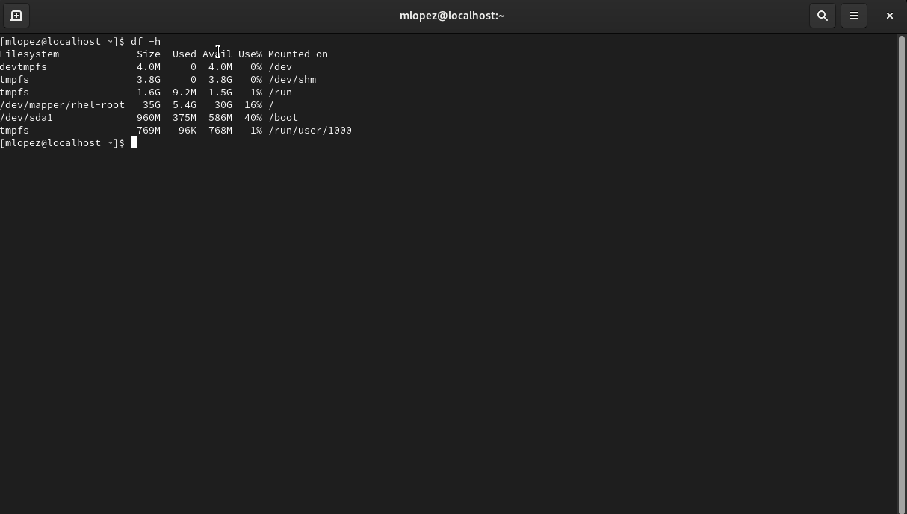

# SEV-1 Disk Space Exhaustion Causing Service Impact

---

##  Scenario

A monitoring alert is triggered indicating degraded system performance and application instability on a Red Hat Enterprise Linux 9 host. Users report failures when applications attempt to write logs or temporary data.

Initial investigation suggests that the root filesystem may be at or near full capacity, preventing normal system operations. The objective is to validate disk utilization, identify the source of excessive usage, safely remediate the issue, and confirm full recovery.

---

##  Environment

* **Operating System:** Red Hat Enterprise Linux 9
* **Platform:** VirtualBox
* **Incident Type:** Storage / Disk Exhaustion
* **Severity:** SEV-1

---

## 🚨 Incident Trigger

Monitoring systems (CloudWatch, Nagios) report:

* High disk utilization alerts
* Application write failures
* System performance degradation

Users report:

* Application errors
* Logging failures

---

# 🟢 PHASE 1 — BASELINE VALIDATION

##  Objective

Confirm disk is healthy before simulating failure.

---

###  Step 1 — Check Disk Usage

```bash
df -hscr
```

###  Explanation

Displays filesystem usage and available space.

---

###  Screenshot





---

# 🔴 PHASE 2 — SIMULATE FAILURE (DISK EXHAUSTION)

##  Objective

Simulate a real-world disk space issue caused by excessive log growth.

---

###  Step 2 — Create Large File

```bash
sudo fallocate -l 5G /var/log/bigfile.log
```

###  Explanation

Creates a large file to consume disk space, simulating uncontrolled log growth or application output.

---

###  Screenshot


---

###  Step 3 — Verify Disk is Full

```bash
df -h
```

###  Expected Result

Root filesystem (`/`) approaches or reaches 100% utilization.

---

###  Screenshot

```
screenshots/disk-exhaustion/03-disk-full.png
```

---

# 🔍 PHASE 3 — INVESTIGATION

##  Objective

Identify where disk usage is coming from and isolate the root cause.

---

###  Step 4 — Identify Large Directories

```bash
sudo du -sh /* 2>/dev/null
```

###  Explanation

Summarizes disk usage by top-level directories.

---

### Screenshot

```
screenshots/disk-exhaustion/04-du-root.png
```

---

###  Step 5 — Drill Into /var

```bash
sudo du -sh /var/* 2>/dev/null
```

### Explanation

Focuses on `/var`, where logs and variable data are stored.

---

### Screenshot

```
screenshots/disk-exhaustion/05-du-var.png
```

---

###  Step 6 — Identify Specific File

```bash
sudo ls -lh /var/log
```

###  Explanation

Lists files in `/var/log` to identify large log files.

---

### Screenshot

```
screenshots/disk-exhaustion/06-bigfile.png
```

---

#  ROOT CAUSE

Disk space exhaustion caused by excessive file growth within `/var/log`, specifically a large log file consuming available storage and preventing normal system operations.

---

# 🟢 PHASE 4 — RESOLUTION

##  Objective

Safely reclaim disk space and restore system functionality.

---

###  Step 7 — Remove Large File

```bash
sudo rm -f /var/log/bigfile.log
```

###  Explanation

Removes the file responsible for disk exhaustion.

---

###  Screenshot

```
screenshots/disk-exhaustion/07-remove-file.png
```

---

# 🟢 PHASE 5 — VALIDATION

##  Objective

Confirm disk space has been restored and system is healthy.

---

###  Step 8 — Verify Disk Recovery

```bash
df -h
```

###  Expected Result

Disk usage decreases and free space is restored.

---

###  Screenshot

```
screenshots/disk-exhaustion/08-disk-recovered.png
```

---

#  ADVANCED CHECK

```bash
df -i
```

### 🧠 Explanation

Checks inode usage, another potential cause of storage-related issues.

---

# 📣 BRIDGE CALL UPDATE

"The issue was caused by disk space exhaustion due to excessive file growth within /var/log. The offending file was identified and removed. Disk utilization has returned to normal levels, and system functionality has been fully restored."

---

# 🧠 LESSONS LEARNED

* Monitor disk utilization proactively
* Log growth can cause critical system failures
* Always trace disk usage before deleting files
* Validate recovery after remediation
* Storage issues can escalate to SEV-1 incidents

---

# 💪 SKILLS DEMONSTRATED

* Disk utilization analysis (`df`, `du`)
* File system investigation
* Log directory analysis
* Root cause identification
* Safe remediation
* Recovery validation
* Incident response methodology

---

# 📸 SCREENSHOT DIRECTORY

```
screenshots/disk-exhaustion/
```

Include:

* baseline disk usage
* disk exhaustion
* investigation steps
* large file identification
* resolution
* recovery validation

---

## 📸 Evidence

### Baseline


### Disk Exhaustion


### Investigation


### Root Cause


### Resolution


### Recovery


---
