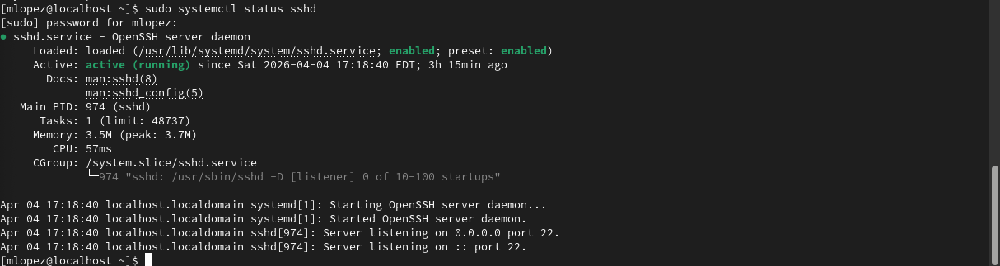

#  SEV-2 SSH Authentication / Security Investigation

---

##  INCIDENT OBJECTIVE

Simulate repeated failed SSH login attempts to investigate potential unauthorized access activity.
This incident focuses on **log analysis, pattern detection, and security awareness**, replicating a real-world security alert scenario in a Linux environment.

---

##  REAL-WORLD CONTEXT

A monitoring alert is triggered indicating multiple failed SSH login attempts on a production Linux host.

As a Service Operations Analyst, your responsibility is to:

* Investigate authentication logs
* Identify suspicious patterns
* Determine if a security threat exists
* Validate that no unauthorized access occurred

---

#  PHASE 1 — BASELINE (NORMAL STATE)

## Objective

Confirm SSH service is running and system is operating normally before simulation.

---

## Step 1 — Verify SSH Service Status

```bash
sudo systemctl status sshd
```

### Expected Result

* SSH service is active (running)

Screenshot




---

## Step 2 — Review Recent SSH Logs

```bash
sudo journalctl -u sshd --no-pager | tail -20
```

### Expected Result

* Minimal or normal login activity
* No repeated failures

 Screenshot
`screenshots/ssh-incident/02-normal-logs.png`

---

#  PHASE 2 — INCIDENT SIMULATION (FAILED SSH ATTEMPTS)

## Objective

Simulate repeated failed login attempts to mimic suspicious activity.

---

## Step 3 — Generate Failed SSH Logins

Run the following multiple times:

```bash
ssh fakeuser@localhost
```

👉 Enter incorrect password each time
👉 Repeat 5–10 times

---

### What This Simulates

* Brute-force login attempts
* Unauthorized access attempts
* Security alert conditions

Screenshot
`screenshots/ssh-incident/03-failed-login.png`

---

#  PHASE 3 — INVESTIGATION

## Objective

Analyze logs to identify suspicious authentication patterns.

---

## Step 4 — Review SSH Authentication Logs

```bash
sudo journalctl -u sshd --no-pager | tail -50
```

### What to Look For

* "Failed password" entries
* Repeated login attempts
* Same user or pattern

Screenshot
`screenshots/ssh-incident/04-log-analysis.png`

---

## Step 5 — Filter Failed Login Attempts

```bash
sudo journalctl -u sshd | grep "Failed password"
```

### Expected Result

* Clear visibility of repeated failed login attempts

Screenshot
`screenshots/ssh-incident/05-failed-filter.png`

---

# 🧠 ROOT CAUSE

Repeated failed SSH login attempts were identified, indicating:

* Potential brute-force attack behavior
* Unauthorized access attempts
* Suspicious authentication activity

No successful login was observed.

---
#  PHASE 4 — RESPONSE / MITIGATION

## Objective

Demonstrate security awareness and response validation.

---

## Step 6 — Review Failed Login Records

```bash
sudo lastb
```

### Expected Result

* List of failed login attempts
* Confirms authentication failures occurred

Screenshot
`screenshots/ssh-incident/06-lastb.png`

---

## (Optional Advanced Step — Awareness)

```bash
sudo faillog
```

---

#  PHASE 5 — VALIDATION

## Objective

Ensure no continued suspicious activity and confirm system stability.

---

## Step 7 — Check Recent SSH Activity

```bash
sudo journalctl -u sshd --since "10 minutes ago"
```

### Expected Result

* No new suspicious login patterns
* System stable

 Screenshot
`screenshots/ssh-incident/07-validation.png`

---

# 📣 BRIDGE CALL UPDATE

"The system triggered alerts due to multiple failed SSH login attempts. Log analysis confirmed repeated authentication failures with no successful access. No compromise was detected. Activity appears consistent with unauthorized login attempts. System remains stable."

---

# 🧠 LESSONS LEARNED

* Authentication logs are critical for security monitoring
* Repeated failures can indicate attack patterns
* Log filtering improves investigation speed
* Early detection prevents escalation

---

# 💪 SKILLS DEMONSTRATED

* Linux log analysis (`journalctl`)
* Security investigation
* Pattern detection
* Authentication troubleshooting
* Incident response workflow

---

